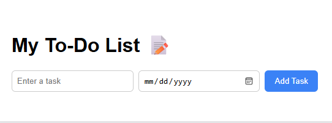

# 📝 To-Do List App

This is a simple and interactive to-do list application built with **HTML**, **CSS**, and **JavaScript**. Users can add tasks, check them off as complete, and remove them from the list. It’s lightweight, responsive, and designed for easy task management.

## 🚀 Live Demo

🌐 [View the Live App](https://aseantir.github.io/todo-list/)  
*(If the link doesn't work yet, make sure your GitHub Pages is set to `main` → `/ (root)` and that you have an `index.html` in the root folder.)*

## 📸 Screenshots

## ✨ Features

- ✅ Add new tasks
- 📝 Mark tasks as completed
- ❌ Remove tasks from the list
- 💻 Clean and readable UI
- 📱 Responsive on mobile devices (optional if you’ve styled it that way)

## 🛠️ Built With

- HTML5
- CSS3
- JavaScript (Vanilla)

## 📁 Folder Structure

